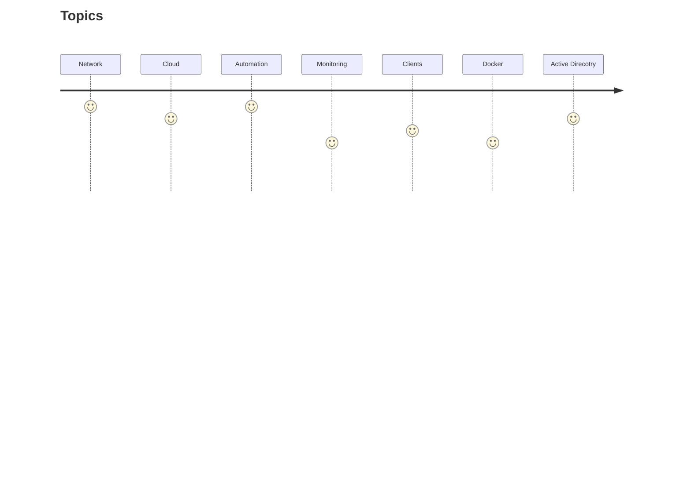
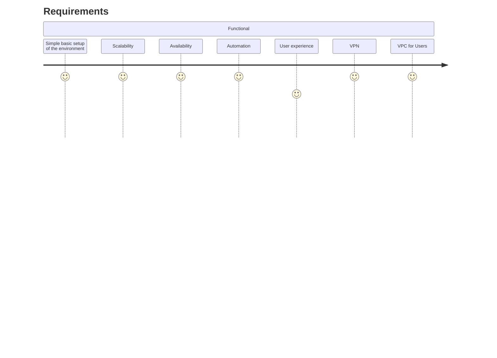
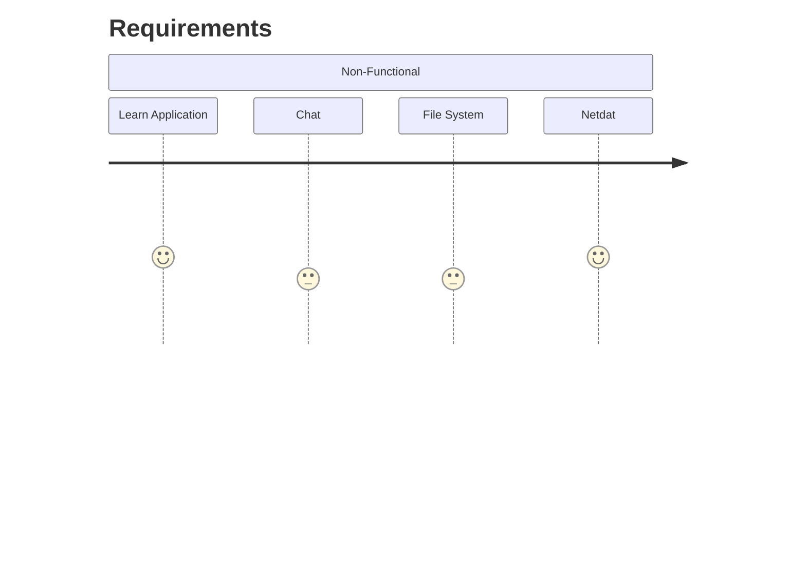
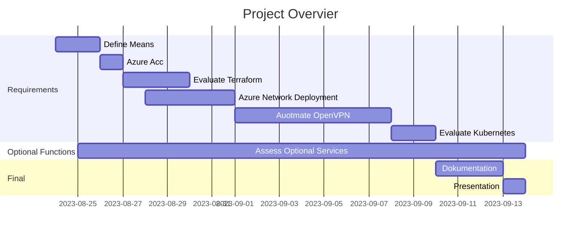
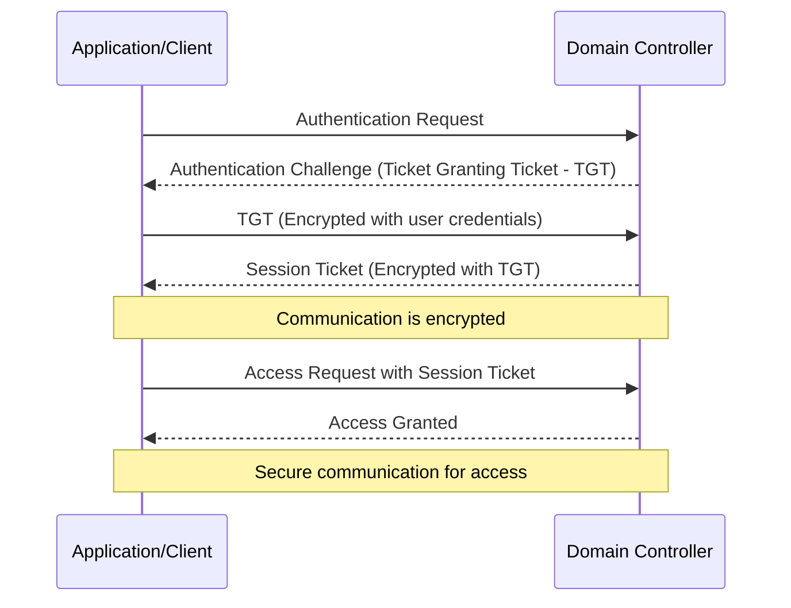

<br />
<div align="center">
  <a href="https://gitlab.autonubil.net/noerkelit/learnitnow/docu-learnitnow">
    
  </a>

  <h3 align="center">Deploy a IaC in to Azure</h3>

  <p align="center">
    How to Deploy a Infrastructure to Azure with Terraform!
    <br />
    <a href="https://gitlab.autonubil.net/noerkelit/learnitnow/docu-learnitnow"><strong>Explore the docs »</strong></a>
    <br />
    <br />
    <a href="https://demo.noerkelit.online:3000/">View the example Service</a>
    ·
    <a href="https://gitlab.autonubil.net/noerkelit/learnitnow/docu-learnitnow/-/issues">Report Bug</a>
  </p>
</div>

# Lernfeld 10 - Deploy server services and automate administration tasks

<details>
  <summary>Table of Contents</summary>
  <ol>
    <li>
      <a href="#introduction">Introduction</a>
      <ul>
        <li><a href="#content-overview">Content Overview</a></li>
      </ul>
    </li>
    <li>
      <a href="#setup">Setup</a>
      <ul>
        <li><a href="#installing-terraform-on-linux">Installing Terraform on Linux</a></li>
        <li><a href="#docker-installation">Docker Installation</a></li>
        <li><a href="#azure-ad-in-student-account">Azure AD in Student Account</a></li>
        <li><a href="#azure-cli-installation">Azure CLI Installation</a></li>
        <li><a href="#netdata-installation-with-docker">Netdata Installation with Docker</a></li>
        <li><a href="#manage-kubernetes-over-k9s">Manage Kubernetes over K9s</a></li>
      </ul>
    </li>
    <li><a href="#task">Task</a></li>
    <li><a href="#start-with-the-szenario">Start with the Szenario</a>
      <ul>
        <li><a href="#terrfaform-azure-connection">Terrfaform Azure connection</a></li>
        <li><a href="#terraform-configuration">Terraform Configuration</a></li>
        <li><a href="#creating-azure-virtual-network-and-subnets">Creating Azure Virtual Network and Subnets</a></li>
        <li><a href="#azure-virtual-network">Azure Virtual Network</a></li>
        <li><a href="#subnet-for-services">Subnet for Services</a></li>
        <li><a href="#subnet-for-vpn-clients">Subnet for VPN Clients</a></li>
        <li><a href="#azure-public-ip-for-gateway">Azure Public IP for Gateway</a></li>
        <li><a href="#azure-network-security-groups-(nsg)">Azure Network Security Groups (NSG)</a>
          <ul>
            <li><a href="#nsg-for-openvpn-and-ssh">NSG for OpenVPN and SSH</a>
            <li><a href="#nsg-for-hosted-services">NSG for Hosted Services</a>
            <li><a href="#nsg-for-vpc">NSG for VPC</a>
            <li><a href="#nsg-for-kubernetes">NSG for Kubernetes</a>
            <li><a href="#nsg-for-vpn-clients">NSG for VPN Clients</a>
            <li><a href="#Subnet-nsg-association">Subnet NSG Association</a>
          </ul>
        </li>
      </ul>
      <li><a href="#ad">AD</a>
        <ul>
          <li><a href="#powershell">PowerShell</a></li>
          <li><a href="#ad#network-interface">Network Interface</a></li>
          <li><a href="#ad#virtual-machine">Virtual Machine</a></li>
          <li><a href="#ad#assign-nsg">Assign NSG</a></li>
          <li><a href="#ad#Run Script">Run Script</a></li>
        </ul>
      </li>
      <li><a href="#azure-virtual-machine-(vm)-for-openvpn">Azure Virtual Machine (VM) for OpenVPN</a>
        <ul>
          <li><a href="#azure-virtual-machine-(vm)-for-openvpn#network-interface">Network Interface</a></li>
          <li><a href="#azure-virtual-machine-(vm)-for-openvpn#virtual-machine">Virtual Machine</a></li>
          <li><a href="#azure-virtual-machine-(vm)-for-openvpn#vm-extension-for-custom-script">VM Extension for Custom Script</a></li>
        </ul>
      </li>
      <li><a href="#vpc">VPC</a></li>
      <li><a href="#domain-join">Domain Join</a></li>
      <li><a href="#kubernetes">Kubernetes</a>
        <ul>
          <li><a href="#example-deployment-flow">Example Deployment Flow</a></li>
        </ul>
      </li>
    </li>
    <li><a href="#contact-&-support">Contact & Support</a></li>
  </ol>
</details>

# Introduction

This project was developed in Itech vocational school in Hamburg, Germany, the scenario took place in an educational institution that provides virtual machines (VMs) to students. The main goal of this project is to provide server services and simplify administrative tasks. The focus is on the successful implementation of the educational app, which highlights the importance of this initiative. The complexity of the project required a series of careful steps, each of which included the configuration of various tools and services.

## Content Overview

This section is dedicated to the specific requirements of the project. It provides a detailed description of both functional and non-functional requirements. Clear definition of these requirements is crucial for the successful completion of the project as they serve as a guide for the development and testing phases.

**Objectives**

The objective of this section is to identify, document, and manage all requirements to ensure that the final product meets the expectations of stakeholders.

**Functional Requirements**

Functional requirements describe the main functions and features that must be included in the final product. These requirements specify what the system should do to meet user needs.

**Non-Functional Requirements**

These are more optional features that would be nice if we get them implemented in the short timeframe for th

But first, let's limit the topics and give them priority





Now that we have the topics and the most important requirements in front of us, we should think about what means are available to us to achieve these goals.
Since we are students, we have a Microsoft Students account at our disposal. With this we get school tenant a separate area in which we can roll out cloud resources, it is important to note that not all functionalities such as Intune or Azure AD are available.

So it is already clear that we will use Azure to provide our network. However, in order to make the whole thing more automated, an Infrastructure as Code (IaaC) solution such as Terraform comes in handy.

In this way, we will definitely achieve availability, good scalability and automation.
But how do we get it for custom apps or other services that can be deployed via Docker? In any case, a Kubernetes cluster would be a good choice for this.

So in short we use:

[](https://www.terraform.io/)
[](https://azure.microsoft.com/)
[](https://kubernetes.io/)
[](https://www.docker.com/)
[](https://openvpn.net/)



Now we also have the Optional functions here, but why is something like Active Directory Optional? As mentioned above, not everything is included in the Student, including no Azure AD. If someone decided to run everything in the Azure cloud, they would also run the AD there. Also, LDAP is an extremely complex system and the Linux alternatives also take some time to set up, especially if the main criterion is intended to be full automation. The time factor is also for the other options the main reason why they do not come into the functional. It is important that the basic framework once stands and the other services could be integrated there also purely.

The following things are ideally integrated with pure:

[](https://docs.microsoft.com/en-us/windows-server/identity/ad-ds/get-started/virtual-ds/introduction-to-active-directory-domain-services--ad-ds-)
[](https://ldap.com/)
[](https://web.mit.edu/kerberos/)

[](https://www.netdata.cloud/)

[](https://rocket.chat/)
[](https://github.com/noahzmr/react-chat)

We have talked a lot about time now, but what exactly is the temporal frame? August 24, 2023 (a Thursday) until September 15, 2023. The first two days are usually meeting and planning days, so it starts on August 28. The deadline is September 13. So you have 2.5 weeks for the project.



# Setup

## Installing Terraform on Linux

Follow these steps to install Terraform on your Linux system:

1. **Update Package Repositories:**
   Open a terminal and enter the following command to update your package repositories:

   ```bash
   sudo apt-get update
   ```

2. **Install Required Dependencies:**
   Install the necessary dependencies by executing the following command:

   ```bash
   sudo apt-get install -y gnupg software-properties-common
   ```

3. **Download HashiCorp GPG Key:**
   Download the HashiCorp GPG key and add it to your keyring:

   ```bash
   wget -O- https://apt.releases.hashicorp.com/gpg | \
   gpg --dearmor | \
   sudo tee /usr/share/keyrings/hashicorp-archive-keyring.gpg
   ```

4. **Verify GPG Key Fingerprint:**
   Verify the GPG key fingerprint by running the following command:

   ```bash
   gpg --no-default-keyring \
   --keyring /usr/share/keyrings/hashicorp-archive-keyring.gpg \
   --fingerprint
   ```

5. **Add HashiCorp Repository:**
   Add the HashiCorp repository to your package sources:

   ```bash
   echo "deb [signed-by=/usr/share/keyrings/hashicorp-archive-keyring.gpg] \
   https://apt.releases.hashicorp.com $(lsb_release -cs) main" | \
   sudo tee /etc/apt/sources.list.d/hashicorp.list
   ```

6. **Update Package Information:**
   Update your package information to include the HashiCorp repository:

   ```bash
   sudo apt update
   ```

7. **Install Terraform:**
   Finally, install Terraform using the following command:
   ```bash
   sudo apt-get install terraform
   ```

After completing these steps, you will have Terraform successfully installed on your Linux system. You can verify the installation by running:

```bash
terraform --version
```

## Docker Installation

Follow these steps to install Docker on your system:

1. **Update Package Repositories:**
   Open a terminal and update your package repositories:

   ```bash
   sudo apt-get update
   ```

2. **Install Dependencies:**
   Install required dependencies for Docker installation:

   ```bash
   sudo apt-get install -y apt-transport-https ca-certificates curl software-properties-common
   ```

3. **Add Docker GPG Key:**
   Download and add Docker's GPG key to your system:

   ```bash
   curl -fsSL https://download.docker.com/linux/ubuntu/gpg | sudo gpg --dearmor -o /usr/share/keyrings/docker-archive-keyring.gpg
   ```

4. **Add Docker Repository:**
   Add the Docker repository to your package sources:

   ```bash
   echo "deb [signed-by=/usr/share/keyrings/docker-archive-keyring.gpg] https://download.docker.com/linux/ubuntu $(lsb_release -cs) stable" | sudo tee /etc/apt/sources.list.d/docker.list > /dev/null
   ```

5. **Update Package Information:**
   Update your package information to include the Docker repository:

   ```bash
   sudo apt-get update
   ```

6. **Install Docker:**
   Install Docker using the following command:
   ```bash
   sudo apt-get install -y docker-ce docker-ce-cli containerd.io
   ```
7. **Start and Enable Docker:**
   Start the Docker service and enable it to start on boot:
   ```bash
   sudo systemctl start docker
   sudo systemctl enable docker
   ```
8. **Verify Installation:**
   Check if Docker is running and accessible:
   ```bash
   sudo docker --version
   ```

## Azure AD in Student Account

Befor we can start we need our own Azure Active Direcoty.
To Create one in the Student account we navigate to the <a hrfe="https://portal.azure.com/#view/Microsoft_Azure_SubscriptionManagement"> subscription manager</a> and create a new.

## Azure CLI Installation

Follow these steps to install the Azure CLI on your system:

1. **Update Package Repositories:**
   Open a terminal and update your package repositories:

   ```bash
   sudo apt-get update
   ```

2. **Install the Azure CLI:**
   Depending on your operating system, use the appropriate commands to install the Azure CLI:

   ```bash
   curl -sL https://aka.ms/InstallAzureCLIDeb | sudo bash
   ```

3. **Verify the Installation:**
   After installation, verify that the Azure CLI is correctly installed by running:

   ```bash
   az --version
   ```

4. **Log in to Azure:**
   To start using the Azure CLI, you need to log in to your Azure account. Run the following command and follow the prompts:
   ```bash
   az login
   ```

## Netdata Installation with Docker

Follow these steps to install Netdata using Docker:

1. **Open a Terminal:**
   Open a terminal or command prompt on your system.

2. **Pull Netdata Docker Image:**
   Run the following command to pull the Netdata Docker image:

   ```bash
   docker pull netdata/netdata
   ```

3. **Run Netdata Container:**
   Launch a Netdata container with the following command:

   ```bash
   docker run -d --name=netdata \
   -p 19999:19999 \
   -v /proc:/host/proc:ro \
   -v /sys:/host/sys:ro \
   -v /var/run/docker.sock:/var/run/docker.sock:ro \
   --cap-add SYS_PTRACE \
   --security-opt apparmor=unconfined \
   --restart unless-stopped \
   netdata/netdata
   ```

4. **Access Netdata Web Interface:**
   Once the container is running, you can access the Netdata web interface by opening your web browser and navigating to `http://localhost:19999`.

## Manage Kubernetes over K9s

1. **Update the system**

```sh
sudo apt-get update -y
```

2. **Install k9s**

Run the following command to install k3s:

```sh
curl -LO https://github.com/derailed/k9s/releases/download/v0.24.2/k9s_Linux_x86_64.tar.gz
tar xzf k9s_Linux_x86_64.tar.gz
chmod +x k9s
sudo mv k9s /usr/local/bin
```

# Task


# Start with the Szenario

```
/root_directory
|-- /initfiles
| |--/ cert
| | | -- cert.cer
| | | -- key.key
| |--/ kubernetes
| | | -- grafana.yaml
| | | -- learnitnow.yaml
| | | -- chat.yaml
| | | -- mariadb.yaml
| | | -- minio.yaml
| | | -- nextcloud.yaml
| | | -- nextcloud.yaml
|-- /scripts
| | | -- setup_client.sh
| | | -- setup_openvpn.sh
|-- 0-provider.tf
|-- 1-network.tf
|-- 2-network-security.tf
|-- 3-openVpn.tf
|-- 4-ad.tf
|-- 5-vpc.tf
|-- 6-kubernetes.tf
|-- 7-kubernetes-provider.tf
|-- 8-kubernetes-database.tf
|-- 9-kubernetes-learnitnow.tf
|-- 10-kubernetes-grafana.tf
|-- 11-kubernetes-nextcloud.tf
|-- kubeconfig_noerkelit.yaml
|-- output.tf
|-- terraform.tfvars
|-- variables.tf
```

## Terrfaform Azure connection

1. **Login**

You can Login over your CLI by entering:

```sh
az login
```

After the login you see your Azure Values:

```json
[
  {
    "cloudName": "AzureCloud",
    "homeTenantId": <Tenant ID>,
    "id": <SUBSCRIPTION ID>,
    "isDefault": true,
    "managedByTenants": [],
    "name": <Subsription>,
    "state": "Enabled",
    "tenantId": <Tenant ID>,
    "user": {
      "name": <User who signed in>,
      "type": "user"
    }
  }
]
```

2. **Create an Azure Service Principal:**

Terraform uses a service principal to authenticate with Azure. Create a service principal using the following Azure CLI command:

```bash
az ad sp create-for-rbac --name <NAME> --role Contributor --scopes /subscriptions/<SUBSCRIPTION_ID>
```

if it was successfully you see the create insatnz values:

```json
{
  "appId": <App ID>,
  "displayName": <Name>,
  "password": <Generated Passwort>,
  "tenant": <Tennant ID>
}
```

3. **Safe values:**

so that alle your credantials are safe we create a `terraform.tfvars` file, where we safe all values from azure. It should like:

```hcl
subscription_id = <SUBSCRIPTION ID>
client_id       = <App ID>
client_secret   = <Generated Passwort>
tenant_id       = <Tennant ID>
```

4. **Use the Value:**

Our data is created in our `variables.tf` and in `terrafotm.tfvars` the values are set, so we don`t have to remember them and they are permanently callable for project.

```terraform
# Azure
variable "subscription_id" {
  type        = string
  description = "Azure Subscription ID"
  sensitive   = true
}

variable "client_id" {
  type        = string
  description = "Azure Client"
}

variable "client_secret" {
  type        = string
  description = "Azure Password for the Client"
  sensitive   = true
}

variable "tenant_id" {
  type        = string
  description = "Azure Tenant for the Client"
}

variable "azure_location" {
  type        = string
  description = "Azure Server Location"
}
```

## Terraform Configuration

Now we can start setting up our Terraform Provider!

For this we create the file `0-provider.tf` and fill it with the following values:

```terraform
# Global Setup for the Terreform enviorment
terraform {
  required_providers {
    # Add the Azue Terraform module
    azurerm = {
      source  = "hashicorp/azurerm",
      version = "~> 3.71.0"
    }
  }
}

# Setup the Azure Module
provider "azurerm" {
  features {}
  subscription_id = var.subscription_id
  client_id       = var.client_id
  client_secret   = var.client_secret
  tenant_id       = var.tenant_id
}

# Create our Ressourcegroup, where we will deploy our enviorment!
resource "azurerm_resource_group" "noerkelit_school" {
  name     = "noerkelit"
  location = var.azure_location
}
```

In this configuration file, we define:

- The Terraform provider (in this case, "azurerm") and its version.
- Azure credentials (Subscription ID, Client ID, Client Secret, Tenant ID).
- The "azurerm_resource_group" resource that creates the Azure Resource Group.

Make sure you set the values of variables (var.subscription_id, var.client_id, var.client_secret, var.tenant_id, var.azure_location) in your Terraform configuration accordingly.

**Check the connection:**

Now we can test the connection with terraform init, if it was succssefully you should see somthing like this:

```

terraform init

Initializing the backend...

Initializing provider plugins...

- Finding latest version of hashicorp/azurerm...
- Installing hashicorp/azurerm v3.71.0...
- Installed hashicorp/azurerm v3.71.0 (signed by HashiCorp)

Terraform has created a lock file .terraform.lock.hcl to record the provider
selections it made above. Include this file in your version control repository
so that Terraform can guarantee to make the same selections by default when
you run "terraform init" in the future.

Terraform has been successfully initialized!

You may now begin working with Terraform. Try running "terraform plan" to see
any changes that are required for your infrastructure. All Terraform commands
should now work.

If you ever set or change modules or backend configuration for Terraform,
rerun this command to reinitialize your working directory. If you forget, other
commands will detect it and remind you to do so if necessary.

```

## Creating Azure Virtual Network and Subnets

In this section, we will create an Azure Virtual Network along with its associated subnets using Terraform.

But the first question we have to ask ourselves is, what should our network look like?
We would take a relatively large network and divide it into several /24 networks, but what kind of networks are needed?
Since we want to have a VPN connection we need a VPN client network.
But also for the VM of the students a separate network is needed.
But where do we run our VPN service or other comings? A small portion will be hosted "on-premise", including the OpenVPN service.
The rest will be rolled out via Kubernetes, so we need a sercvice network.

However, we would still like communication between the subnets to be possible.

And in the service subnet will be the only public IP address, so we can get into the network via VPN!


We also will use `Variables.tf` and `terraform.tfvars` to configure the attributes,
so add the following vars:

```terraform
# Network
variable "address_space_main" {
  type        = string
  description = "IP Address with Prefix"

  validation {
    condition     = can(regex("^((25[0-5]|2[0-4][0-9]|[01]?[0-9][0-9]?)\\.){3}(25[0-5]|2[0-4][0-9]|[01]?[0-9][0-9]?)\\/\\d{1,2}$", var.address_space_main))
    error_message = "The IP address with prefix is not valid! It should look like 0.0.0.0/0"
  }
}

variable "address_space_vpc_clients" {
  type        = string
  description = "IP Address with Prefix"

  validation {
    condition     = can(regex("^((25[0-5]|2[0-4][0-9]|[01]?[0-9][0-9]?)\\.){3}(25[0-5]|2[0-4][0-9]|[01]?[0-9][0-9]?)\\/\\d{1,2}$", var.address_space_vpc_clients))
    error_message = "The IP address with prefix is not valid! It should look like 0.0.0.0/0"
  }
}

variable "kubernetes_cidr" {
  type        = string
  description = "IP Address with Prefix"

  validation {
    condition     = can(regex("^((25[0-5]|2[0-4][0-9]|[01]?[0-9][0-9]?)\\.){3}(25[0-5]|2[0-4][0-9]|[01]?[0-9][0-9]?)\\/\\d{1,2}$", var.kubernetes_cidr))
    error_message = "The IP address with prefix is not valid! It should look like 0.0.0.0/0"
  }
}

variable "address_space_hosted_services" {
  type        = string
  description = "IP Address with Prefix"

  validation {
    condition     = can(regex("^((25[0-5]|2[0-4][0-9]|[01]?[0-9][0-9]?)\\.){3}(25[0-5]|2[0-4][0-9]|[01]?[0-9][0-9]?)\\/\\d{1,2}$", var.address_space_hosted_services))
    error_message = "The IP address with prefix is not valid! It should look like 0.0.0.0/0"
  }
}

variable "address_space_vpn_clients" {
  type        = string
  description = "IP Address with Prefix"

  validation {
    condition     = can(regex("^((25[0-5]|2[0-4][0-9]|[01]?[0-9][0-9]?)\\.){3}(25[0-5]|2[0-4][0-9]|[01]?[0-9][0-9]?)\\/\\d{1,2}$", var.address_space_vpn_clients))
    error_message = "The IP address with prefix is not valid! It should look like 0.0.0.0/0"
  }
}
```

### Azure Virtual Network

Create a new Terraform file named `1-terraform.tf`. Paste the following Terraform code into `1-terraform.tfs`:

```terraform
resource "azurerm_virtual_network" "main" {
  name                = "noerkelit-school-vnet"
  address_space       = [var.address_space_main] # The main address space of the VNet
  location            = azurerm_resource_group.noerkelit_school.location
  resource_group_name = azurerm_resource_group.noerkelit_school.name
}
```

This code defines an Azure Virtual Network named "noerkelit-school-vnet" with the specified address space and associates it with the previously created resource group.

### Subnet for Services

Next, create a subnet within the virtual network for hosting services. Add the following code to your Terraform configuration:

```terraform
resource "azurerm_subnet" "services_network" {
  name                 = "services_network"
  resource_group_name  = azurerm_resource_group.noerkelit_school.name
  virtual_network_name = azurerm_virtual_network.main.name
  address_prefixes     = [var.address_space_hosted_services]
}
```

This code creates a subnet named "services_network" with the specified address prefix within the Azure Virtual Network.

### Subnet for VPN Clients

Now, let's create a subnet for VPN clients within the same virtual network. Add the following Terraform code:

```terraform
resource "azurerm_subnet" "vpn_clients" {
  name                 = "VPN-Clients"
  resource_group_name  = azurerm_resource_group.noerkelit_school.name
  virtual_network_name = azurerm_virtual_network.main.name
  address_prefixes     = [var.address_space_vpn_clients]
}
```

### Azure Public IP for Gateway

To enable connectivity, we need a public IP address for our VPN gateway. Add the following code to your Terraform configuration:

```terraform
resource "azurerm_public_ip" "gateway" {
  name                = "noerkelit.school-public-ip"
  location            = azurerm_resource_group.noerkelit_school.location
  resource_group_name = azurerm_resource_group.noerkelit_school.name
  allocation_method   = "Dynamic"
}
```

This code creates an Azure Public IP named "noerkelit.school-public-ip" with a dynamic allocation method.

### Azure Network Security Groups (NSG)

In this section, we will configure Azure Network Security Groups to control inbound and outbound traffic for different parts of your network.

#### NSG for OpenVPN and SSH

To control access to OpenVPN and SSH services, create an Azure Network Security Group (NSG) as follows:

```terraform
resource "azurerm_network_security_group" "open_vpn_ssh" {
  name                = "myNetworkSecurityGroup"
  location            = azurerm_resource_group.noerkelit_school.location
  resource_group_name = azurerm_resource_group.noerkelit_school.name

  security_rule {
    name                       = "OpenVPN"
    priority                   = 1001
    direction                  = "Inbound"
    access                     = "Allow"
    protocol                   = "Tcp"
    source_port_range          = "*"
    destination_port_range     = "19443"
    source_address_prefix      = "*"
    destination_address_prefix = "*"
  }

  security_rule {
    name                       = "SSH_Backup"
    priority                   = 1003
    direction                  = "Inbound"
    access                     = "Allow"
    protocol                   = "Tcp"
    source_port_range          = "*"
    destination_port_range     = "22"
    source_address_prefix      = "*"
    destination_address_prefix = "*"
  }
  security_rule {
    name                       = "Allow_ICMP"
    priority                   = 1004
    direction                  = "Inbound"
    access                     = "Allow"
    protocol                   = "Icmp"
    source_port_range          = "*"
    destination_port_range     = "*"
    source_address_prefix      = "*"
    destination_address_prefix = "*"
  }
  security_rule {
    name                       = "allow-services-to-vpn"
    priority                   = 100
    direction                  = "Inbound"
    access                     = "Allow"
    protocol                   = "*"
    source_port_range          = "*"
    destination_port_range     = "*"
    source_address_prefix      = var.address_space_hosted_services
    destination_address_prefix = var.address_space_vpn_clients
  }
  security_rule {
    name                       = "allow-rdp-from-services"
    priority                   = 102
    direction                  = "Inbound"
    access                     = "Allow"
    protocol                   = "Tcp"
    source_port_range          = "*"
    destination_port_range     = "3389"
    source_address_prefix      = "*"
    destination_address_prefix = "*"
  }
}
```

This code defines an Azure Network Security Group named "myNetworkSecurityGroup" with various security rules, including rules for OpenVPN, SSH, ICMP, and allowing services to VPN clients.

#### NSG for Hosted Services

```terraform
resource "azurerm_network_security_group" "hosted_services_nw_nsg" {
  name                = "hostedServicesNwNsg"
  location            = azurerm_resource_group.noerkelit_school.location
  resource_group_name = azurerm_resource_group.noerkelit_school.name

  security_rule {
    name                       = "OpenVPN"
    priority                   = 1001
    direction                  = "Inbound"
    access                     = "Allow"
    protocol                   = "Tcp"
    source_port_range          = "*"
    destination_port_range     = "19443"
    source_address_prefix      = "*"
    destination_address_prefix = "*"
  }

  security_rule {
    name                       = "SSH_Backup"
    priority                   = 1003
    direction                  = "Inbound"
    access                     = "Allow"
    protocol                   = "Tcp"
    source_port_range          = "*"
    destination_port_range     = "22"
    source_address_prefix      = "*"
    destination_address_prefix = "*"
  }
  security_rule {
    name                       = "Allow_ICMP"
    priority                   = 1004
    direction                  = "Inbound"
    access                     = "Allow"
    protocol                   = "Icmp"
    source_port_range          = "*"
    destination_port_range     = "*"
    source_address_prefix      = "*"
    destination_address_prefix = "*"
  }
  security_rule {
    name                       = "RDP"
    priority                   = 101
    direction                  = "Inbound"
    access                     = "Allow"
    protocol                   = "Tcp"
    source_port_range          = "*"
    destination_port_range     = "3389"
    source_address_prefix      = "*"
    destination_address_prefix = "*"
  }
}
```

#### NSG for VPC

```terraform
resource "azurerm_network_security_group" "vpc_client_nsg" {
  name                = "vpc-client-nsg"
  location            = azurerm_resource_group.noerkelit_school.location
  resource_group_name = azurerm_resource_group.noerkelit_school.name
  security_rule {
    name                       = "allow-vpc-to-services"
    priority                   = 100
    direction                  = "Inbound"
    access                     = "Allow"
    protocol                   = "*"
    source_port_range          = "*"
    destination_port_range     = "*"
    source_address_prefix      = var.address_space_vpc_clients
    destination_address_prefix = var.address_space_hosted_services
  }

  security_rule {
    name                       = "allow-vpc-to-kubernetes"
    priority                   = 101
    direction                  = "Inbound"
    access                     = "Allow"
    protocol                   = "*"
    source_port_range          = "*"
    destination_port_range     = "*"
    source_address_prefix      = var.address_space_vpc_clients
    destination_address_prefix = var.kubernetes_cidr
  }
  security_rule {
    name                       = "allow-vpc-to-vpn"
    priority                   = 102
    direction                  = "Inbound"
    access                     = "Allow"
    protocol                   = "*"
    source_port_range          = "*"
    destination_port_range     = "*"
    source_address_prefix      = var.address_space_vpc_clients
    destination_address_prefix = var.address_space_vpn_clients
  }
}
```

#### NSG for Kubernetes

```terraform
resource "azurerm_network_security_group" "kubernetes_nsg" {
  name                = "k8s-nsg"
  location            = azurerm_resource_group.noerkelit_school.location
  resource_group_name = azurerm_resource_group.noerkelit_school.name
  security_rule {
    name                       = "allow-k8s-to-services"
    priority                   = 100
    direction                  = "Inbound"
    access                     = "Allow"
    protocol                   = "*"
    source_port_range          = "*"
    destination_port_range     = "*"
    source_address_prefix      = var.kubernetes_cidr
    destination_address_prefix = var.address_space_hosted_services
  }

  security_rule {
    name                       = "allow-k8s-to-vpn"
    priority                   = 101
    direction                  = "Inbound"
    access                     = "Allow"
    protocol                   = "*"
    source_port_range          = "*"
    destination_port_range     = "*"
    source_address_prefix      = var.kubernetes_cidr
    destination_address_prefix = var.address_space_vpn_clients
  }
  security_rule {
    name                       = "allow-k8s-to-vpc"
    priority                   = 102
    direction                  = "Inbound"
    access                     = "Allow"
    protocol                   = "*"
    source_port_range          = "*"
    destination_port_range     = "*"
    source_address_prefix      = var.kubernetes_cidr
    destination_address_prefix = var.address_space_vpc_clients
  }

  security_rule {
    name                       = "Nginx"
    priority                   = 1001
    direction                  = "Inbound"
    access                     = "Allow"
    protocol                   = "Tcp"
    source_port_range          = "*"
    destination_port_range     = "80"
    source_address_prefix      = "*"
    destination_address_prefix = "*"
  }

  security_rule {
    name                       = "Nginx-secure"
    priority                   = 1002
    direction                  = "Inbound"
    access                     = "Allow"
    protocol                   = "Tcp"
    source_port_range          = "*"
    destination_port_range     = "443"
    source_address_prefix      = "*"
    destination_address_prefix = "*"
  }

  security_rule {
    name                       = "learn-app"
    priority                   = 1003
    direction                  = "Inbound"
    access                     = "Allow"
    protocol                   = "Tcp"
    source_port_range          = "*"
    destination_port_range     = "3001"
    source_address_prefix      = "*"
    destination_address_prefix = "*"
  }
}
```

#### NSG for VPN Clients

Finally, create an NSG for VPN clients:

```terraform
resource "azurerm_network_security_group" "vpn_client_nsg" {
  name                = "vpn-client-nsg"
  location            = azurerm_resource_group.noerkelit_school.location
  resource_group_name = azurerm_resource_group.noerkelit_school.name
  security_rule {
    name                       = "allow-vpn-to-services"
    priority                   = 100
    direction                  = "Inbound"
    access                     = "Allow"
    protocol                   = "*"
    source_port_range          = "*"
    destination_port_range     = "*"
    source_address_prefix      = var.address_space_vpn_clients
    destination_address_prefix = var.address_space_hosted_services
  }

  security_rule {
    name                       = "allow-vpn-to-kubernetes"
    priority                   = 101
    direction                  = "Inbound"
    access                     = "Allow"
    protocol                   = "*"
    source_port_range          = "*"
    destination_port_range     = "*"
    source_address_prefix      = var.address_space_vpn_clients
    destination_address_prefix = var.kubernetes_cidr
  }
  security_rule {
    name                       = "allow-vpn-to-vpc"
    priority                   = 102
    direction                  = "Inbound"
    access                     = "Allow"
    protocol                   = "*"
    source_port_range          = "*"
    destination_port_range     = "*"
    source_address_prefix      = var.address_space_vpn_clients
    destination_address_prefix = var.address_space_vpc_clients
  }

  security_rule {
    name                       = "allow-dhcp-to-vpn-clients"
    priority                   = 130
    direction                  = "Inbound"
    access                     = "Allow"
    protocol                   = "Udp"
    source_port_range          = "*"
    destination_port_range     = "67-68"
    source_address_prefix      = var.address_space_vpn_clients
    destination_address_prefix = var.address_space_vpn_clients
  }
}
```

This NSG can have rules for VPN clients, including allowing VPN traffic and DHCP communication.

#### Subnet NSG Association

Associate the NSGs with their respective subnets:

```terraform
resource "azurerm_subnet_network_security_group_association" "vpn_client_nsg_association" {
  subnet_id                 = azurerm_subnet.vpn_clients.id
  network_security_group_id = azurerm_network_security_group.vpn_client_nsg.id
}

resource "azurerm_subnet_network_security_group_association" "kubernetes_nsg_association" {
  subnet_id                 = azurerm_subnet.kubernetes_network.id
  network_security_group_id = azurerm_network_security_group.kubernetes_nsg.id
}
```

## AD

In this section, we will provision an Azure Virtual Machine for our Actice Directory and Domain Controller using Terraform.
For our "On-Premise" decives we have to declar a user and a passwort or ssh token, for this modify `variables.tf` and `terraform.tfvars`

```terraform

variable "domain_name" {
  type    = string
  default = "noerkelit.online"
}

variable "dc_name" {
  type    = string
  default = "dc-01"
}


variable "domain_netbios_name" {
  type    = string
  default = "noerkelit"
}

variable "domain_mode" {
  type    = string
  default = "WinThreshold"
}

variable "database_path" {
  type    = string
  default = "C:/Windows/NTDS"
}

variable "sysvol_path" {
  type    = string
  default = "C:/Windows/SYSVOL"
}

variable "log_path" {
  type    = string
  default = "C:/Windows/NTDS"
}

variable "safe_mode_administrator_password" {
  type    = string
}

variable "dc_ipv4" {
  type        = string
  description = "IPv4 Address for the Domain Controller"
}
```

### PowerShell

To set up the virtual machine as a domain controller, we need the local bash script, which we will run later:

```terraform
locals {
  cmd00      = "Set-TimeZone -Id 'W. Europe Standard Time'"
  cmd01      = "Install-WindowsFeature AD-Domain-Services -IncludeAllSubFeature -IncludeManagementTools"
  cmd02      = "Install-WindowsFeature DNS -IncludeAllSubFeature -IncludeManagementTools"
  cmd03      = "Import-Module ADDSDeployment, DnsServer"
  cmd04      = "Install-ADDSForest -DomainName ${var.domain_name} -DomainNetbiosName ${var.domain_netbios_name} -DomainMode ${var.domain_mode} -ForestMode ${var.domain_mode} -DatabasePath ${var.database_path} -SysvolPath ${var.sysvol_path} -LogPath ${var.log_path} -NoRebootOnCompletion:$false -Force:$true -SafeModeAdministratorPassword (ConvertTo-SecureString '${var.safe_mode_administrator_password}' -AsPlainText -Force)"
  powershell = "${local.cmd00};${local.cmd01}; ${local.cmd02}; ${local.cmd03}; ${local.cmd04}"
}
```

### Network Interface

```terraform
resource "azurerm_network_interface" "winosnic" {
  name                = "${var.dc_name}-nic"
  resource_group_name = azurerm_resource_group.noerkelit_school.name
  location            = azurerm_resource_group.noerkelit_school.location

  ip_configuration {
    name                          = "internal"
    subnet_id                     = azurerm_subnet.services_network.id
    private_ip_address_allocation = "Static"
    private_ip_address            = var.dc_ipv4
  }
```

### Virtual Machine

```terraform
resource "azurerm_windows_virtual_machine" "dc_vm" {
  name                = var.dc_name
  resource_group_name = azurerm_resource_group.noerkelit_school.name
  location            = azurerm_resource_group.noerkelit_school.location
  size                = "Standard_DS1_v2"
  admin_username      = var.username
  admin_password      = var.nze_password
  network_interface_ids = [
    azurerm_network_interface.winosnic.id,
  ]

  os_disk {
    storage_account_type = "Standard_LRS"
    caching              = "ReadWrite"
  }

  source_image_reference {
    publisher = "MicrosoftWindowsServer"
    offer     = "WindowsServer"
    sku       = "2019-Datacenter"
    version   = "latest"
  }
}
```

### Assign NSG

```terraform
resource "azurerm_network_interface_security_group_association" "securitygroup" {
  network_interface_id      = azurerm_network_interface.winosnic.id
  network_security_group_id = azurerm_network_security_group.hosted_services_nw_nsg.id
}
```

### Run Script

Now we can run our script:

```terraform
resource "azurerm_virtual_machine_extension" "software" {
  depends_on = [azurerm_windows_virtual_machine.dc_vm]

  name                       = "setup-dc"
  virtual_machine_id         = azurerm_windows_virtual_machine.dc_vm.id
  publisher                  = "Microsoft.Compute"
  type                       = "CustomScriptExtension"
  type_handler_version       = "1.10"
  auto_upgrade_minor_version = true

  settings = <<SETTINGS
     {
         "commandToExecute": ""
     }
 SETTINGS

  protected_settings = <<PROTECTED_SETTINGS
     {
         "commandToExecute": "powershell.exe -ExecutionPolicy Unrestricted -Command \"${local.powershell}\""
     }
 PROTECTED_SETTINGS
}
```

## Azure Virtual Machine (VM) for OpenVPN

In this section, we will provision an Azure Virtual Machine for hosting your OpenVPN server using Terraform.
For our "On-Premise" decives we have to declar a user and a passwort or ssh token, for this modify `variables.tf` and `terraform.tfvars`

```terraform
# General User
variable "username" {
  type        = string
  description = "User Name Shorrt for user three"
}


variable "nze_ssh_pub" {
  description = "NZeumer Pub SSH Key"
  type        = string
  sensitive   = true
}
```

### Network Interface

Create an Azure Network Interface (NIC) for your OpenVPN VM:

```terraform
resource "azurerm_network_interface" "open_vpn_nic" {
  name                = "open_vpn_nic"
  location            = azurerm_resource_group.noerkelit_school.location
  resource_group_name = azurerm_resource_group.noerkelit_school.name

  ip_configuration {
    name                          = "open_vpn_nic_config"
    subnet_id                     = azurerm_subnet.services_network.id
    private_ip_address_allocation = "Static"
    private_ip_address            = var.openvpn_ipv4
    public_ip_address_id          = azurerm_public_ip.gateway.id
  }
}
```

This code creates an Azure Network Interface named "open_vpn_nic" and associates it with the specified subnet. It also configures a static private IP address and links it to the previously created public IP address.

### Virtual Machine

Now, let's create the Azure Virtual Machine for OpenVPN:

```terraform
resource "azurerm_virtual_machine" "open_vpn_vm" {
  name                  = "open-vpn-01"
  location              = azurerm_resource_group.noerkelit_school.location
  resource_group_name   = azurerm_resource_group.noerkelit_school.name
  network_interface_ids = [azurerm_network_interface.open_vpn_nic.id]
  vm_size               = "Standard_DS1_v2"

  storage_os_disk {
    name              = "osOpenVpnUbu"
    caching           = "ReadWrite"
    create_option     = "FromImage"
    managed_disk_type = "Premium_LRS"
  }

  storage_image_reference {
    publisher = "Canonical"
    offer     = "0001-com-ubuntu-server-focal"
    sku       = "20_04-lts"
    version   = "latest"
  }

  os_profile {
    computer_name  = "open-vpn-01"
    admin_username = var.username
  }

  os_profile_linux_config {
    disable_password_authentication = true
    ssh_keys {
      path     = "/home/admnzeumer/.ssh/authorized_keys"
      key_data = var.nze_ssh_pub
    }
  }
}
```

This code defines an Azure Virtual Machine named "open-vpn-01" and associates it with the previously created NIC. Make sure to customize the storage, image, and other VM settings as required.

### VM Extension for Custom Script

```terraform
resource "azurerm_virtual_machine_extension" "custom_script" {
  name                 = "customscript"
  virtual_machine_id   = azurerm_virtual_machine.open_vpn_vm.id
  publisher            = "Microsoft.Azure.Extensions"
  type                 = "CustomScript"
  type_handler_version = "2.1"

  settings = <<SETTINGS
     {
         "script": ""
     }
 SETTINGS

  protected_settings = <<PROTECTED_SETTINGS
     {
         "script": "${base64encode(file("${path.module}/script/setup_openvpn.sh"))}"
     }
 PROTECTED_SETTINGS
}
```

To execute a custom script on the VM, we use a VM extension. Here's how to configure it:

This code configures a VM extension to run a custom script on the Virtual Machine. Make sure to provide the script content or path as needed.

#### The Setup Script

```sh
#!/bin/bash

public_ip="20.218.74.87"
vpn_port="19443"
vpn_protokoll="tcp"
openVpn_netzwork="10.0.5.0 255.255.255.0"
sudo usermod -aG sudo admnzeumer
setup_log="/home/admnzeumer/openvpn-setup.log"
setup_log_2="/home/admnzeumer/clean-openvpn-setup.log"
>"$setup_log"
common_name="openvpn.noerkelit.online"
DOMAIN_NAME="noerkelit.online"
DOMAIN_NAME_UPPERCASE="NOERKELIT.ONLINE"
USERNAME="admnzeumer"
DC_IP="10.0.3.4"
IP_ADDRES=$(ip addr show eth0 | grep -o 'inet [0-9.]*' | awk '{print $2}')
INTERFACE_NAME="eth0"
DEIN_PASSWORT="2quick4U!Hola"
exec >>"$setup_log" 2>&1

output() {
    local component="$1"
    local message="$2"
    local status="$3"

    # Farbcodierung und Emoji je nach Status
    case "$status" in
    "success")
        color="\e[32m"
        emoji="✅"
        ;;
    "error")
        color="\e[31m"
        emoji="❌"
        ;;
    "warning")
        color="\e[33m"
        emoji="❗"
        ;;
    "info")
        color="\e[0m"
        emoji="ℹ️"
        ;;
    "validierung")
        color="\e[95m"
        emoji="✔️"
        ;;
    "complete")
        color="\e[95m"
        emoji="🎉"
        ;;
    "failed")
        color="\e[31m"
        emoji="☠️"
        ;;
    esac

    local timestamp=$(date +"%Y-%m-%d %H:%M:%S")
    local formatted_component="[$component] "
    local formatted_status="[$emoji $status $emoji] "

    # Berechnen der Längen für die Ausrichtung
    local component_length=${#formatted_component}
    local status_length=${#formatted_status}

    # Erstellen der Ausgabe mit der richtigen Ausrichtung
    local output_message="$timestamp $formatted_status$message"
    local padding_length=$((80 - ${#output_message} - component_length - status_length))

    if [ "$padding_length" -gt 0 ]; then
        local padding=" "
        while [ ${#padding} -lt $padding_length ]; do
            padding+=" "
        done
        output_message+=" $formatted_component$color$padding\e[0m"
    else
        output_message+=" $formatted_component$color\e[0m"
    fi

    echo -e "$output_message"
}

cleanup() {

    systemctl stop openvpn-server@server.service

    fuser -k -n tcp $vpn_port

    rm -rf "/etc/openvpn/" "/home/admnzeumer/pki" "/var/log/openvpn/ipp.txt"

    output "Cleanup" "OpenVPN-Dienst wurde gestoppt. Port $vpn_port wurde freigegeben. Alle neu erstellten Pfade und Dateien wurden gelöscht." "success"
}

set_ntp_server_to_hamburg() {
    sudo timedatectl set-ntp yes
    sudo timedatectl set-timezone Europe/Berlin
    output "NTP" $(timedatectl show --property=NTP) "info"
    output "NTP" $(timedatectl show --property=Timezone) "info"
}

modify_easyrsa_vars() {
    local vars_file="/etc/openvpn/easy-rsa/pki/vars"

    # Ändere den Pfad zur CA-Datei
    sed -i 's/^#set_var EASYRSA_REQ_COUNTRY.*/set_var EASYRSA_REQ_COUNTRY    "DE"/' "$vars_file"

    # Ändere das Ablaufdatum für Zertifikate auf 365 Tage
    sed -i 's/^#set_var EASYRSA_CERT_EXPIRE.*/set_var EASYRSA_CERT_EXPIRE    365/' "$vars_file"

    # Ändere das Ablaufdatum für die CA auf 5 Jahre (1825 Tage)
    sed -i 's/^#set_var EASYRSA_CA_EXPIRE.*/set_var EASYRSA_CA_EXPIRE      1825/' "$vars_file"

    # Aktiviere den Batch-Modus für das automatische Signieren von Zertifikaten
    sed -i 's/^#set_var EASYRSA_BATCH.*/set_var EASYRSA_BATCH          "yes"/' "$vars_file"

    # Setze DN-Variablen
    sed -i 's/^#set_var EASYRSA_REQ_PROVINCE.*/set_var EASYRSA_REQ_PROVINCE   "Hamburg"/' "$vars_file"
    sed -i 's/^#set_var EASYRSA_REQ_CITY.*/set_var EASYRSA_REQ_CITY       "Hamburg"/' "$vars_file"
    sed -i 's/^#set_var EASYRSA_REQ_ORG.*/set_var EASYRSA_REQ_ORG        "noerkelIT"/' "$vars_file"
    sed -i 's/^#set_var EASYRSA_REQ_EMAIL.*/set_var EASYRSA_REQ_EMAIL      "it@noerkel.de"/' "$vars_file"
    sed -i 's/^#set_var EASYRSA_REQ_OU.*/set_var EASYRSA_REQ_OU         "IT"/' "$vars_file"
    sed -i 's/^#set_var EASYRSA_REQ_CN.*/set_var EASYRSA_REQ_CN         "noerkelIT hiknzu"/' "$vars_file"
}

installer() {
    sudo apt-get update
    sudo apt-get install openvpn -y
    sudo apt-get install git -y
}

set_openvpn_default_working_directory() {
    local openvpn_service_file="/etc/systemd/system/openvpn-server@server.service"
    local default_working_directory="/etc/openvpn"

    sed -i 's/^WorkingDirectory=.*/WorkingDirectory=\/etc\/openvpn/' /lib/systemd/system/openvpn-server@.service

    if [ ! -f "$openvpn_service_file" ]; then
        output "OpenVpn-WorkDir" "Die systemd-Serviceeinheit '$openvpn_service_file' existiert nicht." "error"
    fi

    sudo sed -i "s|^WorkingDirectory=.*|WorkingDirectory=$default_working_directory|" "$openvpn_service_file"

    output "OpenVpn-WorkDir" "Arbeitsverzeichnis für den OpenVPN-Dienst auf den Standardpfad '$default_working_directory' gesetzt." "succsess"
}

basic_setup() {
    check_success() {
        local exit_code=$?
        if [ $exit_code -eq 0 ]; then
            output "OpenVPN-Setup" "Erfolgreich abgeschlossen." "validierung"
        else
            output "OpenVPN-Setup" "Fehler aufgetreten (Exit-Code: $exit_code)." "error"
            return 0
        fi
    }

    if [ ! -f "/etc/openvpn/server.conf" ]; then
        output "OpenVPN-Setup" "OpenVPN wird installiert..."

        installer
        check_success

        output "OpenVPN-Setup" "Klonen von Easy-RSA von GitHub..."
        git clone https://github.com/OpenVPN/easy-rsa.git /etc/openvpn/easy-rsa/
        check_success

        cd /etc/openvpn/easy-rsa/
        output "OpenVPN-Setup" "Initialisiere PKI (Public Key Infrastructure)..."
        sudo /etc/openvpn/easy-rsa/easyrsa3/easyrsa init-pki
        modify_easyrsa_vars
        check_success

        output "OpenVPN-Setup" "Erstelle Certificate Authority (CA)..."
        sudo /etc/openvpn/easy-rsa/easyrsa3/easyrsa build-ca nopass
        check_success

        output "OpenVPN-Setup" "Erstelle Serverzertifikat und Schlüssel..."
        sudo /etc/openvpn/easy-rsa/easyrsa3/easyrsa gen-req server nopass
        sudo /etc/openvpn/easy-rsa/easyrsa3/easyrsa sign-req server server
        check_success

        output "OpenVPN-Setup" "Generiere Diffie-Hellman-Parameter..."
        sudo openssl dhparam -out /etc/openvpn/dh2048.pem 2048
        check_success

        output "OpenVPN-Setup" "Generiere TLS-Authentifizierungsschlüssel..."
        sudo openvpn --genkey --secret /etc/openvpn/ta.key
        check_success

        output "OpenVPN-Setup" "Kopiere Zertifikate und Schlüssel..."
        sudo cp /etc/openvpn/easy-rsa/pki/ca.crt /etc/openvpn
        sudo cp /etc/openvpn/easy-rsa/pki/issued/server.crt /etc/openvpn
        sudo cp /etc/openvpn/easy-rsa/pki/private/server.key /etc/openvpn
        sudo cp /etc/openvpn/easy-rsa/pki/dh.pem /etc/openvpn
        sudo cp /etc/openvpn/ta.key /etc/openvpn
        check_success

        output "OpenVPN-Setup" "Entpacke Server-Konfigurationsdatei..."
        sudo gunzip -c /usr/share/doc/openvpn/examples/sample-config-files/server.conf.gz | sudo tee /etc/openvpn/server.conf
        check_success

        output "OpenVPN-Setup" "Bearbeite Server-Konfigurationsdatei..."
        update_openVpn_conf
        check_success

        output "OpenVPN-Setup" "Aktiviere IP-Weiterleitung..."
        sudo sed -i 's/#net.ipv4.ip_forward=1/net.ipv4.ip_forward=1/' /etc/sysctl.conf
        sudo sysctl -p
        check_success

        output "OpenVPN-Setup" "Aktiviere und starte OpenVPN-Dienst..."
        sudo systemctl enable openvpn-server@server
        sudo systemctl start openvpn-server@server
        check_success

        output "OpenVPN-Setup" "OpenVPN wurde erfolgreich installiert und konfiguriert."
    else
        output "OpenVPN-Setup" "OpenVPN ist bereits installiert."
    fi
}

update_openVpn_conf() {
    local config_file="/etc/openvpn/server.conf"
    set_openvpn_default_working_directory

    if [ -f "$config_file" ]; then

        cat <<EOL | sudo tee "$config_file"
port $vpn_port
proto  $vpn_protokoll
dev tun
ca ca.crt
cert server.crt
key server.key
dh dh2048.pem
server $openVpn_netzwork
ifconfig-pool-persist /var/log/openvpn/ipp.txt
keepalive 10 120
push "route 10.0.1.0 255.255.255.0"
push "route 10.0.2.0 255.255.255.0"
push "route 10.0.3.0 255.255.255.0"
push "dhcp-option DNS 8.8.8.8"
push "dhcp-option DNS 8.8.4.4"
tls-auth ta.key 0
cipher AES-256-CBC
persist-key
persist-tun
status /var/log/openvpn/openvpn-status.log
verb 3
EOL
        output "OpenVPN" "OpenVPN-Konfiguration wurde aktualisiert: TCP-Protokoll, Port 19443 und VPN-Netzwerk $openVpn_netzwork." "success"

    else
        output "OpenVPN" "Die OpenVPN-Konfigurationsdatei $config_file existiert nicht." "error"
    fi
}

generate_client_certificates() {
    local client_name="$1"
    local easyrsa_path="/etc/openvpn/easy-rsa/"

    if [ ! -f "$easyrsa_path/pki/issued/$client_name.crt" ] || [ ! -f "$easyrsa_path/pki/private/$client_name.key" ]; then
        sudo /etc/openvpn/easy-rsa/easyrsa3/easyrsa build-client-full "$client_name" nopass
    fi
}

create_client_config() {
    local client_name="$1"
    local client_config_path="/etc/openvpn/client-configs"
    local client_config_file="$client_config_path/$client_name.ovpn"
    generate_client_certificates "$client_name"

    if [ ! -d "$client_config_path" ]; then
        output "Client-Konfiguration" "Das Verzeichnis für die Client-Konfigurationen ($client_config_path) fehlt." "error"
        sudo mkdir -p "$client_config_path"
    fi

    if [ -f "$client_config_file" ]; then
        output "Client-Konfiguration" "Die Client-Konfiguration für $client_name existiert bereits." "warning"
    else
        sudo cp /usr/share/doc/openvpn/examples/sample-config-files/client.conf "$client_config_file"

        cat <<EOL | sudo tee "$client_config_file"
client
dev tun
proto $vpn_protokoll
remote $public_ip $vpn_port
resolv-retry infinite
nobind
persist-key
persist-tun
remote-cert-tls server
tls-auth ta.key 1
cipher AES-256-CBC
verb 3
dev tun
user nobody
group nogroup
remote-cert-tls server
key-direction 1
<ca>
$(cat "/etc/openvpn/ca.crt")
</ca>
<cert>
$(cat "/etc/openvpn/easy-rsa/pki/issued/$client_name.crt")
</cert>
<key>
$(cat "/etc/openvpn/easy-rsa/pki/private/$client_name.key")
</key>
<tls-auth>
$(cat "/etc/openvpn/ta.key")
</tls-auth>
EOL

        output "Client-Konfiguration" "Die Client-Konfiguration für $client_name wurde erstellt: $client_config_file" "success"
    fi

}

restart_openvpn_service() {
    local action="$1"
    if [ "$action" == "start" ]; then
        sudo systemctl start openvpn-server@server
        output "OpenVPN Service" "Der OpenVPN-Dienst wurde gestartet." "success"
    elif [ "$action" == "restart" ]; then
        sudo systemctl restart openvpn-server@server
        output "OpenVPN Service" "Der OpenVPN-Dienst wurde neu gestartet." "success"
    else
        output "OpenVPN Service" "Ungültige Aktion. Verwenden Sie 'start' oder 'restart'." "error"
    fi
}

check_setup_success() {
    local openvpn_conf="/etc/openvpn/server.conf"
    local client_name="nzeumer"

    if [ ! -f "$openvpn_conf" ]; then
        output "Setup-Prüfung" "OpenVPN-Konfigurationsdatei fehlt: $openvpn_conf" "validierung"
        return 1
    fi

    if ! grep -q "proto tcp" "$openvpn_conf" || ! grep -q "port 19443" "$openvpn_conf" || ! grep -q "server $openVpn_netzwork" "$openvpn_conf"; then
        output "Setup-Prüfung" "Die OpenVPN-Konfiguration wurde nicht vollständig angepasst." "validierung"
        return 1
    fi

    local client_config="/etc/openvpn/client-configs/$client_name.ovpn"
    if [ ! -f "$client_config" ]; then
        output "Setup-Prüfung" "Die Client-Konfiguration für $client_name fehlt: $client_config" "validierung"
        return 1
    fi

    if ! systemctl is-active --quiet openvpn-server@server; then
        output "Setup-Prüfung" "Der OpenVPN-Dienst ist nicht gestartet." "validierung"
        return 1
    fi

    output "Setup-Prüfung" "Das Setup wurde erfolgreich abgeschlossen." "validierung"
    return 0
}

setupt_ufw() {

    output "UFW" "Setup the Firewall..." "Info"

    sudo sed -i 's/#net.ipv4.ip_forward=1/net.ipv4.ip_forward=1/' /etc/sysctl.conf
    sudo sysctl -p

    sudo sed -i 's/DEFAULT_FORWARD_POLICY="DROP"/DEFAULT_FORWARD_POLICY="ACCEPT"/' /etc/default/ufw

    sudo ufw --force enable
    sudo ufw default allow

    if ! grep -q '10.0.5.0/24' /etc/ufw/before.rules; then
        sudo bash -c 'cat <<EOL >>/etc/ufw/before.rules

# NAT-Regeln für 10.0.5.0/24
*nat
:POSTROUTING ACCEPT [0:0]
-A POSTROUTING -s 10.0.5.0/24 -o eth0 -j MASQUERADE
COMMIT
EOL'
    fi

    sudo ufw status numbered | grep -q '1443/tcp'
    if [ $? -ne 0 ]; then
        output "UFW" "Allow OpenVpn Port..." "Info"

        sudo ufw allow 1443/tcp
    fi

    sudo ufw status numbered | grep -q '22/tcp'
    if [ $? -ne 0 ]; then
        output "UFW" "Allow SSH Port" "Info"
        sudo ufw allow 22/tcp
    fi

    sudo ufw disable
    sudo ufw enable

    output "UFW" $(sudo ufw status) "info"
    sudo iptables -P FORWARD ACCEPT

    if ! sudo iptables -t nat -C POSTROUTING -s 10.0.5.0/24 -o eth0 -j MASQUERADE 2>/dev/null; then
        sudo iptables -t nat -A POSTROUTING -s 10.0.5.0/24 -o eth0 -j MASQUERADE
        output "NAT" "IPTABLES-NAT-Regel hinzugefügt." "info"
    else
        output "NAT" "IPTABLES-NAT-Regel existiert bereits." "info"
    fi
}

install_docker() {
    sudo apt-get update

    sudo apt-get install -y apt-transport-https ca-certificates curl software-properties-common

    curl -fsSL https://download.docker.com/linux/ubuntu/gpg | sudo gpg --dearmor -o /usr/share/keyrings/docker-archive-keyring.gpg

    echo "deb [signed-by=/usr/share/keyrings/docker-archive-keyring.gpg] https://download.docker.com/linux/ubuntu $(lsb_release -cs) stable" | sudo tee /etc/apt/sources.list.d/docker.list >/dev/null
    sudo apt-get update

    sudo apt-get install -y docker-ce docker-ce-cli containerd.io

    sudo systemctl start docker
    sudo systemctl enable docker
}
install_netdata() {
    sudo docker pull netdata/netdata

    sudo docker run -d --name=netdata \
        -p 19999:19999 \
        -v /proc:/host/proc:ro \
        -v /sys:/host/sys:ro \
        -v /var/run/docker.sock:/var/run/docker.sock:ro \
        --cap-add SYS_PTRACE \
        --security-opt apparmor=unconfined \
        --restart unless-stopped \
        netdata/netdata
}
set_ntp_server_to_hamburg

dns_seeting() {
    output "DNS" "Update System and install dependencys" "info"
    sudo apt update -y
    sudo apt upgrade -y
    sudo apt install resolvconf -y

    output "DNS" "Setze die neuen DNS Server" "info"
    sudo tee /etc/resolvconf/resolv.conf.d/head >/dev/null <<EOL
nameserver $DC_IP
nameserver 8.8.8.8
EOL

    output "DNS" "Update Conf file" "info"
    sudo resolvconf --enable-updates
    sudo resolvconf -u

    output "DNS" "restart" "info"
    sudo systemctl restart resolvconf.service
    sudo systemctl restart systemd-resolved.service

    systemd-resolve --status
}

domain_join() {
    dns_seeting
    hostname=$(hostname)
    output "Domain-Join" "Updatehostname" "info"
    sudo hostnamectl set-hostname $(hostname)

    sudo tee /etc/hosts >/dev/null <<EOL
    127.0.0.1      localhost
    $IP_ADDRES     $(hostname) $(hostname).$DOMAIN_NAME
EOL

    sudo tee /etc/lmhosts >/dev/null <<EOL
    $IP_ADDRES     ${hostname^^}
EOL

    output "Domain-Join" "Install Needed Dependencies" "info"
    sudo apt-get update
    sudo DEBIAN_FRONTEND=noninteractive apt-get install realmd sssd sssd-tools samba-common smbclient krb5-user packagekit samba-common-bin oddjob oddjob-mkhomedir adcli -y

    output "Kerberos-Config" "Configuring Kerberos" "info"
    sudo tee /etc/krb5.conf >/dev/null <<EOL
[logging]
default = FILE:/var/log/krb5libs.log

[libdefaults]
    default_realm = $DOMAIN_NAME_UPPERCASE
    kdc_timesync = 1
    ccache_type = 4
    forwardable = true
    proxiable = true
    ticket_lifetime = 24h
    rdns = false

[realms]
    $DOMAIN_NAME_UPPERCASE = {
        kdc = $DC_IP
        admin_server = $DC_IP
    }

[domain_realm]
    .$DOMAIN_NAME = $DOMAIN_NAME_UPPERCASE
    $DOMAIN_NAME = $DOMAIN_NAME_UPPERCASE
EOL
    output "Kerberos-Config" "Restart Kerberos" "info"
    sudo systemctl restart krb5-user
    output "Domain-Join" "Join the Domain" "info"
    kinit $USERNAME@$DOMAIN_NAME_UPPERCASE
    echo $DEIN_PASSWORT | sudo realm join --user=admnzeumer@DOMAIN_NAME_UPPERCASE dc-01.$DOMAIN_NAME

}

# cleanup

setupt_ufw

basic_setup

update_openVpn_conf

create_client_config "nzeumer"

restart_openvpn_service "start"
check_setup_success

install_docker
install_netdata

domain_join

if [ $? -eq 0 ]; then
    output "Setup-Prüfung" "Das Setup war erfolgreich. Weitere Aktionen können durchgeführt werden." "complette"
else
    output "Setup-Prüfung" "Das Setup war nicht erfolgreich. Bitte überprüfen Sie die Ausgaben und beheben Sie Probleme." "failed"
fi

grep -v 'TESTING ENCRYPT/DECRYPT of packet' $setup_log >$setup_log_2
exit 0
```

## VPC

The VPCs for the individual users are very similar in structure to the Terraform file, namely a script is executed here which insatllates docker and Netdata.

Here, too, a NIC is created first and then assigned to the VM

```terraform
##########################
# Start of one VPC Block #
# ########################
resource "azurerm_network_interface" "vpc_nze_nic" {
  name                = "vpc_nze_nic"
  location            = azurerm_resource_group.noerkelit_school.location
  resource_group_name = azurerm_resource_group.noerkelit_school.name

  ip_configuration {
    name                          = "vpc_nze_nic_config"
    subnet_id                     = azurerm_subnet.vpc_clients.id
    private_ip_address_allocation = "Dynamic"
  }
}

resource "azurerm_virtual_machine" "vpc_nze_vm" {
  # Optimize the name for the user
  name                  = "nzeumer-vm-01"
  location              = azurerm_resource_group.noerkelit_school.location
  resource_group_name   = azurerm_resource_group.noerkelit_school.name
  network_interface_ids = [azurerm_network_interface.vpc_nze_nic.id]
  vm_size               = "Standard_DS1_v2"

  storage_os_disk {
    name              = "osNzeVpcUbu"
    caching           = "ReadWrite"
    create_option     = "FromImage"
    managed_disk_type = "Premium_LRS"
  }

  storage_image_reference {
    publisher = "Canonical"
    offer     = "0001-com-ubuntu-server-focal"
    sku       = "20_04-lts"
    version   = "latest"
  }

  os_profile {
    computer_name = "nzeumer-vm-01"
    # Optimize Username
    admin_username = var.username
  }

  os_profile_linux_config {
    disable_password_authentication = true
    ssh_keys {
      path = "/home/${var.username}/.ssh/authorized_keys"
      # SSH Pub key from the user
      key_data = var.nze_ssh_pub
    }
  }
}

resource "azurerm_virtual_machine_extension" "setup_vpc_nze" {
  name                 = "customscript"
  virtual_machine_id   = azurerm_virtual_machine.vpc_nze_vm.id
  publisher            = "Microsoft.Azure.Extensions"
  type                 = "CustomScript"
  type_handler_version = "2.1"

  settings = <<SETTINGS
     {
         "script": ""
     }
 SETTINGS

  protected_settings = <<PROTECTED_SETTINGS
     {
         "script": "${base64encode(file("${path.module}/script/client_netdata.sh"))}"
     }
 PROTECTED_SETTINGS
}

resource "azurerm_network_interface_security_group_association" "vpc_nze_nic_association" {
  network_interface_id      = azurerm_network_interface.vpc_nze_nic.id
  network_security_group_id = azurerm_network_security_group.vpc_client_nsg.id
}

##########################
# Start of one VPC Block #
# ########################
```

After the machine is created, we install Netdata:

```sh
#!/bin/bash
install_docker() {
    sudo apt-get update

    sudo apt-get install -y apt-transport-https ca-certificates curl software-properties-common

    curl -fsSL https://download.docker.com/linux/ubuntu/gpg | sudo gpg --dearmor -o /usr/share/keyrings/docker-archive-keyring.gpg

    echo "deb [signed-by=/usr/share/keyrings/docker-archive-keyring.gpg] https://download.docker.com/linux/ubuntu $(lsb_release -cs) stable" | sudo tee /etc/apt/sources.list.d/docker.list >/dev/null
    sudo apt-get update

    sudo apt-get install -y docker-ce docker-ce-cli containerd.io

    sudo systemctl start docker
    sudo systemctl enable docker
}
install_netdata() {
    sudo docker pull netdata/netdata

    sudo docker run -d --name=netdata \
        19999:19999 \
        /proc:/host/proc:ro \
        /sys:/host/sys:ro \
        /var/run/docker.sock:/var/run/docker.sock:ro \
        SYS_PTRACE \
        apparmor=unconfined \
        unless-stopped >-p >-v >-v >-v >--cap-add >--security-opt >--restart \
        >netdata/netdata
}

install_docker
install_netdata
```

## Domain Join

The script appears to be responsible for configuring DNS settings and joining a Linux machine to an Active Directory domain.

```sh
dns_seeting() {
    output "DNS" "Update System and install dependencys" "info"
    sudo apt update -y
    sudo apt upgrade -y
    sudo apt install resolvconf -y

    output "DNS" "Setze die neuen DNS Server" "info"
    sudo tee /etc/resolvconf/resolv.conf.d/head >/dev/null <<EOL
nameserver $DC_IP
nameserver 8.8.8.8
EOL

    output "DNS" "Update Conf file" "info"
    sudo resolvconf --enable-updates
    sudo resolvconf -u

    output "DNS" "restart" "info"
    sudo systemctl restart resolvconf.service
    sudo systemctl restart systemd-resolved.service

    systemd-resolve --status
}

domain_join() {
    dns_seeting
    hostname=$(hostname)
    output "Domain-Join" "Updatehostname" "info"
    sudo hostnamectl set-hostname $(hostname)

    sudo tee /etc/hosts >/dev/null <<EOL
    127.0.0.1      localhost
    $IP_ADDRES     $(hostname) $(hostname).$DOMAIN_NAME
EOL

    sudo tee /etc/lmhosts >/dev/null <<EOL
    $IP_ADDRES     ${hostname^^}
EOL

    output "Domain-Join" "Install Needed Dependencies" "info"
    sudo apt-get update
    sudo DEBIAN_FRONTEND=noninteractive apt-get install realmd sssd sssd-tools samba-common smbclient krb5-user packagekit samba-common-bin oddjob oddjob-mkhomedir adcli -y

    output "Kerberos-Config" "Configuring Kerberos" "info"
    sudo tee /etc/krb5.conf >/dev/null <<EOL
[logging]
default = FILE:/var/log/krb5libs.log

[libdefaults]
    default_realm = $DOMAIN_NAME_UPPERCASE
    kdc_timesync = 1
    ccache_type = 4
    forwardable = true
    proxiable = true
    ticket_lifetime = 24h
    rdns = false

[realms]
    $DOMAIN_NAME_UPPERCASE = {
        kdc = $DC_IP
        admin_server = $DC_IP
    }

[domain_realm]
    .$DOMAIN_NAME = $DOMAIN_NAME_UPPERCASE
    $DOMAIN_NAME = $DOMAIN_NAME_UPPERCASE
EOL
    output "Kerberos-Config" "Restart Kerberos" "info"
    sudo systemctl restart krb5-user
    output "Domain-Join" "Join the Domain" "info"
    kinit $USERNAME@$DOMAIN_NAME_UPPERCASE
    echo $DEIN_PASSWORT | sudo realm join --user=admnzeumer@DOMAIN_NAME_UPPERCASE dc-01.$DOMAIN_NAME

}
```

Let's break down the code section by section:

**`dns_seeting()`**

1. **Output Information**: It provides informational output about the actions it is about to perform.
2. **Update System and Install Dependencies**: The script updates the system packages and installs the resolvconf package, which is a tool for managing DNS information.
3. **Set New DNS Servers**: It appends DNS server entries to the /etc/resolvconf/resolv.conf.d/head file, including the $DC_IP (presumably the domain controller's IP address) and Google's public DNS server 8.8.8.8.
4. **Update Configuration File**: The script enables DNS updates and updates the DNS configuration using resolvconf.
5. **Restart DNS Services**: It restarts the resolvconf and systemd-resolved services to apply the DNS changes.
6. **Display DNS Status**: It displays the DNS configuration status using the systemd-resolve command.

**`domain_join()`**

This function appears to handle the domain joining process and related configurations. It includes the following steps:

1. **Configure DNS**: It first calls the dns_seeting() function to ensure that DNS is correctly configured.
2. **Update Hostname**: It updates the hostname of the machine using hostnamectl.
3. **Update Hosts File**: The script updates the /etc/hosts file with the local IP address and hostname information.
4. **Update LMHosts File**: It updates the /etc/lmhosts file with the local IP address and uppercase hostname.
5. **Install Necessary Dependencies**: It installs several packages required for domain joining, including realmd, sssd, samba-common, and others.
6. **Configure Kerberos**: The script configures Kerberos authentication by updating the /etc/krb5.conf file with realm and domain information.
7. **Restart Kerberos**: It restarts the krb5-user service to apply the Kerberos configuration.
8. **Join the Domain**: The script uses the realm join command to join the Linux machine to the specified Active Directory domain. It appears to expect the USERNAME and DEIN_PASSWORT (presumably your password) to perform this action.

In the `domain_join()` function, the script configures Kerberos as part of the process of joining a Linux machine to an Active Directory domain. Here's an explanation of what Kerberos is and its role in domain joining:

**Kerberos**

- Kerberos is a network authentication protocol that is designed to provide strong authentication for users and services over a non-secure network, such as the internet.
- It is often used in enterprise environments and is an integral part of Microsoft Active Directory (AD) for authentication and security purposes.
- Kerberos relies on a trusted third-party authentication server, known as the Key Distribution Center (KDC), to securely verify the identities of users and services.
- It uses symmetric-key cryptography to ensure the confidentiality and integrity of communications.

**Role of Kerberos in Domain Joining**

- When joining a Linux machine to an Active Directory domain, Kerberos plays a crucial role in establishing trust and secure communication between the Linux machine and the AD domain controller.
- The realm join command used in the script initiates the process of establishing a trust relationship with the AD domain.
- To participate in the AD domain, the Linux machine must be able to authenticate users and services against the AD's Kerberos realm.
- The script configures the Linux machine to use the Kerberos configuration (/etc/krb5.conf) to communicate with the AD KDC for authentication purposes.
- It specifies the realm information, KDC server address, and other necessary Kerberos settings in the /etc/krb5.conf file to ensure that the Linux machine can authenticate with the AD domain.



## Kubernetes

Before we can get started we need to think about what namespaces we need. And which services need to talk to which ones?


Here it will be similar to the Azure connection, as first we have to generate our config via Azure and then adapt the provider.

```terraform
# Define an Azure Kubernetes Service (AKS) cluster resource.
resource "azurerm_kubernetes_cluster" "noerkel_k8s" {
  # Set the location for the AKS cluster to the same as the associated resource group.
  location            = azurerm_resource_group.noerkelit_school.location
  # Define the name for the AKS cluster.
  name                = "noerkel-k8s"
  # Specify the resource group where the AKS cluster will be created.
  resource_group_name = azurerm_resource_group.noerkelit_school.name
  # Set the DNS prefix for the AKS cluster.
  dns_prefix          = "noerkel-k8s"

  # Configure identity settings for the AKS cluster.
  identity {
    type = "SystemAssigned"
  }

  # Define the default node pool for the AKS cluster.
  default_node_pool {
    name       = "agentpool"
    vm_size    = "Standard_D2_v2"
    node_count = 1
  }

  # Configure Linux profile settings for the AKS cluster.
  linux_profile {
    admin_username = var.username

    # Specify SSH key data for authentication.
    ssh_key {
      key_data = var.nze_ssh_pub
    }
  }

  # Configure network profile settings for the AKS cluster.
  network_profile {
    # Specify the network plugin for the AKS cluster.
    network_plugin = "azure"
    # Define the DNS service IP for Kubernetes.
    dns_service_ip = var.dns_kubernetes_ipv4
    # Define the service CIDR range for the AKS cluster.
    service_cidr   = var.service_cidr
  }
}

# Define a null_resource to generate the kubeconfig for the AKS cluster.
resource "null_resource" "generate_kubeconfig" {
  triggers = {
    # Trigger the resource when the kube_config_raw attribute of the AKS cluster changes.
    kubeconfig = azurerm_kubernetes_cluster.noerkel_k8s.kube_config_raw
  }

  # Use a local-exec provisioner to create the kubeconfig file.
  provisioner "local-exec" {
    command = "echo '${azurerm_kubernetes_cluster.noerkel_k8s.kube_config_raw}' > ${var.kubeconfig_path}"
  }

  # Specify that this resource depends on the creation of the AKS cluster.
  depends_on = [azurerm_kubernetes_cluster.noerkel_k8s]
}

# Define the Kubernetes provider using the specified kubeconfig path.
provider "kubernetes" {
  config_path = var.kubeconfig_path
}

# Create a Kubernetes namespace named "learnitnow".
resource "kubernetes_namespace" "learnitow" {
  metadata {
    name = "learnitnow"
  }
}

# Create a Kubernetes namespace named "database".
resource "kubernetes_namespace" "database" {
  metadata {
    name = "database"
  }
}

# Create a Kubernetes namespace named "monitoring".
resource "kubernetes_namespace" "monitoring" {
  metadata {
    name = "monitoring"
  }
}

# Create another Kubernetes namespace named "ingress-basic".
resource "kubernetes_namespace" "ingress" {
  metadata {
    name = "ingress-basic"
  }
}

```

### Example Deployment Flow

We need a MariaDB for the chat as well as for the learning app, the database should be created directly. To achieve this goal we need to add something to our variables again:

```terraform
# MariaDb
variable "db_passwort" {
  type        = string
  description = "Password for the MariaDB"
  sensitive   = true
}

variable "db_name" {
  type        = string
  description = "Name for the MariaDB Database"
}

variable "db_ipv4" {
  type        = string
  description = "IPv4 Address for the MariaDB"
}

variable "db_user" {
  type        = string
  description = "User for the MariaDB"
}

variable "db_port" {
  type        = number
  description = "Port for the MariaDB"
}

variable "script_path" {
  type        = string
  description = "Init SQL Script Path"
}
```

Now we can start to create the `6-kubernetes-databse.tf`

```terraform
# Define a Kubernetes service for MariaDB in the "learnitnow" namespace.
resource "kubernetes_service" "mariadb" {
  metadata {
    name      = "mariadb-service"
    namespace = kubernetes_namespace.learnitow.metadata[0].name
  }

  spec {
    selector = {
      app = "mariadb"
    }

    port {
      port        = var.db_port
      target_port = var.db_port
    }
    type = "ClusterIP"
  }
}

# Define a Kubernetes secret for MariaDB initialization in the "learnitnow" namespace.
resource "kubernetes_secret" "mariadb_init" {
  metadata {
    name      = "mariadb-init"
    namespace = kubernetes_namespace.learnitow.metadata[0].name
  }
  data = {
    "init.sql" : file(var.script_path)
  }
}

# Define a Kubernetes deployment for MariaDB in the "learnitnow" namespace.
resource "kubernetes_deployment" "mariadb" {
  metadata {
    name      = "mariadb-deployment"
    namespace = kubernetes_namespace.learnitow.metadata[0].name
  }

  spec {
    replicas = 1

    selector {
      match_labels = {
        app = "mariadb"
      }
    }

    template {
      metadata {
        labels = {
          app = "mariadb"
        }
      }

      spec {
        container {
          name  = "mariadb"
          image = "mariadb:latest"

          volume_mount {
            name       = "sql-script"
            sub_path   = "init.sql"
            mount_path = "/docker-entrypoint-initdb.d/init.sql"
          }

          env {
            name  = "MYSQL_ROOT_PASSWORD"
            value = var.db_passwort
          }
        }
        volume {
          name = "sql-script"
          secret {
            secret_name = kubernetes_secret.mariadb_init.metadata[0].name
          }
        }
      }
    }
  }
}
```

Now lets add our Coustom Learn Application!

```terraform
resource "kubernetes_service" "learnitnow_service" {
  metadata {
    name      = "learnitnow-service"
    namespace = kubernetes_namespace.learnitow.metadata[0].name
  }

  spec {
    selector = {
      app = "learnitnow"
    }

    port {
      port        = var.learnitnow_port
      target_port = var.learnitnow_port
    }
    type = "ClusterIP"
  }
}

resource "kubernetes_secret" "learnitnow_certificate" {
  metadata {
    name      = "my-learnitnow-certs"
    namespace = kubernetes_namespace.learnitow.metadata[0].name
  }
  data = {
    "cert.pem" : file(var.cert)
    "cert.key" : file(var.key)
  }
}

resource "kubernetes_deployment" "learnitnow_deployment_v2" {
  metadata {
    name      = "my-learnitnow-deployment"
    namespace = kubernetes_namespace.learnitow.metadata[0].name
  }

  spec {
    replicas = 1

    selector {
      match_labels = {
        app = "learnitnow"
      }
    }

    template {
      metadata {
        labels = {
          app = "learnitnow"
        }
      }

      spec {
        container {
          name  = "learnitnow-container"
          image = var.learnitnow_docker_image

          port {
            container_port = var.learnitnow_port
          }

          volume_mount {
            name       = "certificate"
            sub_path   = "cert.pem"
            mount_path = "/noerkelit/learnitnow/cert/cert.cer"
          }

          volume_mount {
            name       = "certificate"
            sub_path   = "cert.key"
            mount_path = "/noerkelit/learnitnow/cert/key.key"
          }

          env {
            name  = "DB_HOST"
            value = var.db_ipv4
          }

          env {
            name  = "DB_PORT"
            value = var.db_port
          }
          env {
            name  = "DB_USER"
            value = var.db_user
          }
          env {
            name  = "DB_PASSWORD"
            value = var.db_passwort
          }
          env {
            name  = "DB_DATABASE"
            value = var.db_name
          }
        }

        volume {
          name = "certificate"
          secret {
            secret_name = kubernetes_secret.learnitnow_certificate.metadata[0].name
          }
        }

      }
    }
  }
}
```

# Contact & Support

<div style='display: flex; flex-direction: row; justify-content: space-around; width: 100%;'>

[](https://www.xing.com/profile/NoahDanyael_Zeumer/)

[](https://www.linkedin.com/in/noah-zeumer-34b5081a5/?originalSubdomain=de)

[](mailto:noah@noerkelit.online)

<a href='https://taag.co/GxxtAjXSpr1679622602xuDhbkVpDX' target="_blank"></a>

</div>

If you want to support my work, you are welcome to buy me a cup of coffee. Just visit my [](https://www.buymeacoffee.com/noahdnylzmr)
and enter an amount of your choice. I am grateful for any support.
Thank you in advance!
